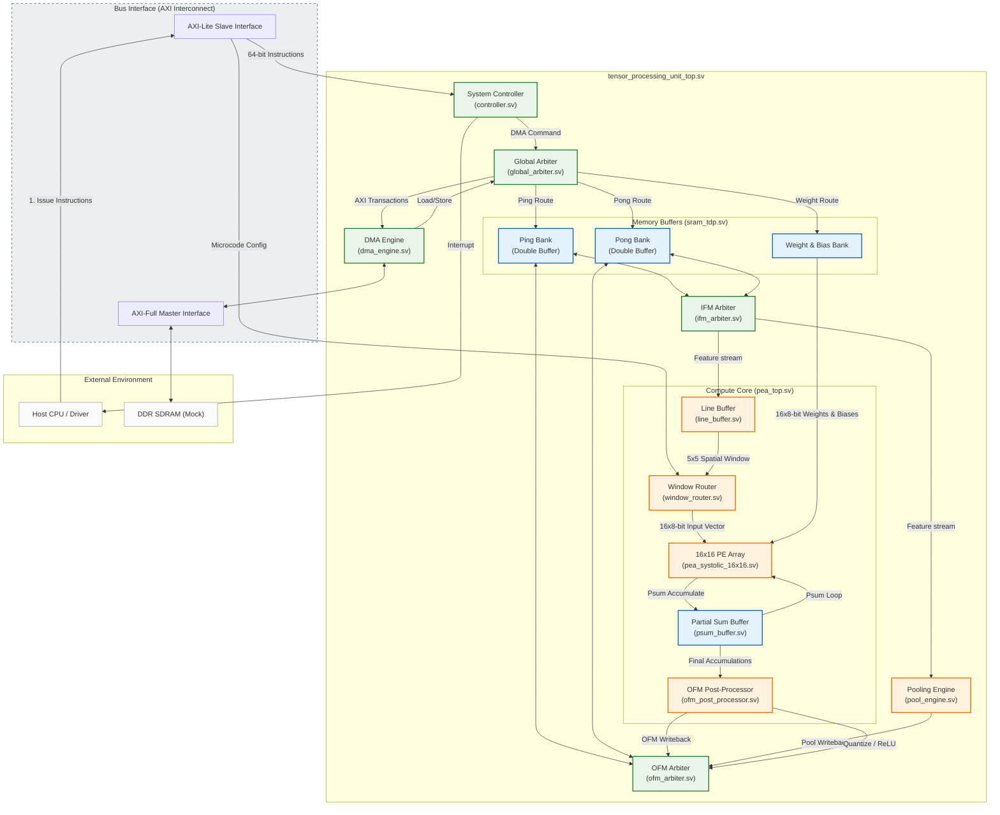

# An Instruction-Driven TPU Accelerator for Real-time Handwritten Digit Recognition on FPGA

## Abstract
This repository presents a custom, register-transfer level (RTL) hardware accelerator designed to execute the LeNet-5 convolutional neural network (CNN) for handwritten digit recognition (MNIST dataset). Architected with a 16x16 Processing Element Array (PEA) and a custom 5-banked SRAM memory subsystem, the accelerator operates on an instruction-driven microcoded control paradigm. It integrates sliding-window convolution, max pooling, and fully-connected computation paths into a unified dataflow engine. Hardware-software co-verification demonstrates 100% bit-level matching against a Python golden reference model. To establish scientific value and practical deployment reference, a case study on resolving timing-drift hazards during the spatial-to-fully-connected layer transition is documented.

---

## 1. Introduction & Design Objectives
Accelerating deep convolutional neural networks (CNNs) on edge hardware demands a delicate balance between compute throughput, memory bandwidth, and control flexibility. This project implements a custom Tensor Processing Unit (TPU) variant optimized for the classical **LeNet-5** architecture. 

The primary research and engineering objectives of this work are:
1. **Parallelized Computation**: Deploying a 16x16 systolic-like Processing Element Array (256 MAC engines) to parallelize channel and spatial dimensions.
2. **Conflict-Free Memory Access**: Designing a multi-banked SRAM subsystem that loads 5x5 convolution windows in a single clock cycle without incurring the logic overhead of massive shift-register chains.
3. **Control Flexibility via Microcode**: Implementing an instruction-driven control layer that decodes high-level commands (e.g., Load Weights, Run MAC, Pool) and routes spatial features dynamically using 160-bit microcode words.
4. **End-to-End RTL Verification**: Running complete hardware-software co-simulations on 100 MNIST test images to ensure hardware correctness.

---

## 2. Hardware Architecture & System Design

The architecture of the LeNet-5 accelerator is partitioned into three key layers: Bus Interface (AXI Interfaces), Control and Orchestration (DMA & Controller FSM), and the Compute Datapath (PEA Subsystem and SRAM Buffers).

### 2.1. System Block Diagram
The system's structural connectivity and data flows are illustrated in the diagram below:



### 2.2. Processing Element Array (PEA)
The core computing engine is a 2D array of $16 \times 16$ Multiply-Accumulate (MAC) units. 
* **Dataflow**: It employs a hybrid Weight-Stationary and Output-Stationary scheme. Weights are pre-loaded into local registers within each PE, and input feature map (IFM) values stream horizontally.
* **Arithmetic Precision**: To save resources and match typical quantized neural network deployment standards, inputs and weights are represented in 8-bit signed integers (`int8`), while the accumulation registers inside the PEs support 32-bit precision to prevent overflow during deep convolutions.

### 2.3. Banked SRAM Memory Subsystem
Directly reading a 5x5 window of features across multiple channels creates a massive bandwidth bottleneck. To solve this without using a cascade of power-hungry shift registers, the SRAM space is partitioned into a **5-banked memory structure**. 
* **Single-Cycle Sliding Window**: The physical memory lanes allow the Line Buffer to read 5 rows in parallel.
* **Ping-Pong Buffer Mechanism**: A double-buffering scheme (Ping Bank & Pong Bank) isolates DMA write transactions from the PE compute loop. While the PE is computing on the Ping bank, the DMA engine can load the next layer's inputs or write back the previous layer's outputs from/to the Pong bank.

---

## 3. Register Map & Instruction Set Architecture (ISA)

### 3.1. AXI-Lite Configuration Space (Base: `0x0000`)
The TPU is configured and monitored via AXI-Lite memory-mapped registers.

| Offset (Hex) | Register Name | Access | Default | Description |
| :--- | :--- | :---: | :---: | :--- |
| `0x0000` | `REG_MAC_DONE` / `REG_FIFO_LOW` | R/W | `32'd0` | **Read**: Returns MAC PEA done status (bit 0). <br>**Write**: Low 32 bits of 64-bit instruction. |
| `0x0004` | `REG_IRQ` / `REG_FIFO_HIGH` | R/W | `32'd0` | **Read**: Returns system IRQ status (bit 0). <br>**Write**: High 32 bits of 64-bit instruction (triggers execution). |
| `0x0100` | `r_reg_ifm_width` | R/W | `32'd0` | Width of the Input Feature Map (IFM). |
| `0x0104` | `r_reg_ifm_height` | R/W | `32'd0` | Height of the Input Feature Map (IFM). |
| `0x0108` | `r_reg_channels_in` | R/W | `32'd0` | Number of input channels ($C_{in}$). |
| `0x010c` | `r_reg_channels_out`| R/W | `32'd0` | Number of output channels ($C_{out}$). |
| `0x0110` | `r_reg_kernel_size` | R/W | `32'd0` | Convolution kernel size (typically 5 or 1). |
| `0x0114` | `r_reg_right_shift` | R/W | `5'd0`  | Scaling parameter: right-shift bits for quantization. |
| `0x0120` | `r_reg_weight_base` | R/W | `32'd0` | Base offset in SRAM for current layer's weights. |
| `0x0124` | `r_reg_bias_base` | R/W | `32'd0` | Base offset in SRAM for current layer's biases. |
| `0x0128` | `r_reg_relu_en` | R/W | `1'b0`  | Enable ReLU activation (bit 0). |
| `0x012c` | `r_reg_pool_en` | R/W | `1'b0`  | Integrated pooling flag. |

### 3.2. 64-bit Instruction Format
The host CPU issues tasks using 64-bit commands. The command structure is partitioned below:

| Opcode (Bits [63:60]) | Instruction Name | Description & Arguments |
| :---: | :--- | :--- |
| `4'h1` | **OP_SET_ADDR** | Configures DDR base address. `[59:58]`: Type (00=IFM, 01=WGT, 10=OFM). `[39:0]`: 40-bit DDR Address. |
| `4'h2` | **OP_SET_DIM** | Sets image geometry. `[47:32]`: IFM Width, `[31:16]`: IFM Height, `[15:0]`: $C_{in}$. |
| `4'h3` | **OP_SET_KNL** | Sets kernel parameters. `[31:16]`: $C_{out}$, `[15:8]`: Kernel Size, `[7:4]`: Stride, `[3:0]`: Right-shift. |
| `4'h4` | **OP_LOAD_WGT** | Triggers AXI DMA weights/biases load from DDR to Weight SRAM. Size (bytes) in `[31:0]`. |
| `4'h5` | **OP_RUN_MAC** | Executes Systolic Array MAC operation. `[0]`: Enable ReLU. |
| `4'h6` | **OP_RUN_POOL**| Runs pooling engine. `[9:8]`: Type (00=Max, 01=Avg), `[7:0]`: Kernel Size (2). |
| `4'h7` | **OP_STORE_OFM**| Triggers DMA writeback of computed OFM to DDR. Size (bytes) in `[31:0]`. |
| `4'h8` | **OP_SYNC** | Blocks execution until preceding DMA transfers conclude. |
| `4'hA` | **OP_LOAD_IFM** | Triggers DMA transfer of inputs from DDR to Ping/Pong SRAM. Size in `[31:0]`. |
| `4'hF` | **OP_FINISH** | Terminal instruction. Asserts system interrupt `finish_irq_o` to Host. |

### 3.3. Window Router Microcode (Base: `0x0200`)
The Window Router connects spatial values from the 5x5 Line Buffer window to the 16 PE rows. This routing is controlled by a **160-bit microcode word** per compute pass (stored from `0x0200` to `0x05FF`). The 160 bits represent sixteen 10-bit routes, one for each PE row:

`Sub-Instruction[r] = microcode_word[r * 10 + 9 : r * 10]`

| Sub-Bit Range | Field Name | Description |
| :---: | :---: | :--- |
| `[9:7]` | `ky` | Y-index in the 5x5 sliding window ($0 \le ky \le 4$). |
| `[6:4]` | `kx` | X-index in the 5x5 sliding window ($0 \le kx \le 4$). |
| `[3:0]` | `cin` | Channel index within the 128-bit memory word ($0 \le cin \le 15$). |

---

## 4. Key Design Decisions & Debug Insights

Reusing general-purpose hardware structures for multiple CNN layers introduces subtle edge cases. During the integration of the Fully Connected (F6) layer (which uses a $1 \times 1$ kernel size), a critical timing drift was identified and resolved.

### 4.1. The 1x1 fully-connected timing hazard
In the original design, the line buffer and window router were configured for 5x5 convolution. When executing a 1x1 fully-connected kernel, the microcode was configured to sample data at a spatial offset of `kx=3, ky=0`. 

However:
1. The data validity flag (`w_valid_stream_window`) triggered the sampling window under the assumption of a 5x5 pipeline delay.
2. For 1x1 kernels, the stream reached the line buffer boundary (`kx=4`) one cycle before the sampling logic expected it at `kx=3`.
3. Consequently, the window router read uninitialized values (`0` or garbage residual values), resulting in random classifications where ~52% of the logits saturated.

```
Cycle N  : [Data In] ---> [Line Buffer kx=4]
Cycle N+1:                 [Line Buffer kx=4] ---> [Line Buffer kx=3] (Correct Sample point)
                           ^^ Trigger fires too early in original design (reads N, where kx=3 is empty)
```

### 4.2. Methodology & Resolution
Instead of relying on waves alone, a quantitative debugging workflow was implemented:
* **Raw MAC Profiling**: We bypassed the output ReLU and quantization clamping stages, dumping the raw accumulation registers (`hardware_raw_psum.log`). This isolated the issue to the PE array arithmetic logic rather than downstream scaling.
* **RTL Instrumentation**: Probes placed at the input ports of the PE array revealed an off-by-one phase shift between inputs and weights.
* **Dynamic Sample Delay**: The solution was to introduce a layer-dependent delay path. A dedicated 3-cycle delayed valid window signal (`w_is_valid_window_d3`) was added specifically for $1 \times 1$ kernel configurations:
  ```systemverilog
  assign w_valid_stream_window = (r_reg_kernel_size == 1) ? w_is_valid_window_d3 : w_is_valid_window_d2;
  ```
This resolved the pipeline misalignment and restored 100% bit-accurate predictions without modifying the 5x5 convolution datapath.

---

## 5. Experimental Evaluation & Resource Utilization

### 5.1. End-to-End Functional Accuracy
The design was validated by executing a complete feedforward sequence on the MNIST test dataset. The execution flow mapped to hardware as follows:

$$\text{Input Image } (32 \times 32) \rightarrow \text{Conv1} \rightarrow \text{Pool1} \rightarrow \text{Conv3} \rightarrow \text{Pool2} \rightarrow \text{Conv5} \rightarrow \text{FC6} \rightarrow \text{Out} \rightarrow \text{Logits}$$

- **E2E Simulation Accuracy**: The hardware simulation achieves **100/100 (100.00%)** accuracy matching on the first 100 test images.
- **Full Dataset Inference (10,000 Images)**:
  - **Float32 Model**: **99.32%** (9,932 / 10,000)
  - **Quantized INT8 (Rounding Shift - Current HW)**: **96.03%** (9,603 / 10,000)
  - **Quantized INT8 (Truncating Shift - Original HW)**: **95.80%** (9,580 / 10,000)
- **Performance Boost**: Upgrading the hardware post-processor from truncating right shifts to rounding arithmetic right shifts yielded a **+0.23%** overall accuracy improvement across the dataset.
- **Bit-Exact Outputs**: Intermediate feature maps extracted from the Ping-Pong SRAM buffers matched the PyTorch golden references to the bit level.

### 5.2. FPGA Synthesis & Resource Metrics
The design was synthesized using Xilinx Vivado. Resource consumption and timing statistics are summarized below:

> [!NOTE]
> The table below is configured with placeholders. Resource metrics will be populated upon final board implementation sweeps.

| FPGA Resource Type | Used Count | Available | Utilization (%) |
| :--- | :---: | :---: | :---: |
| **LUTs (Look-up Tables)** | — | — | — |
| **Registers / FFs** | — | — | — |
| **DSP48E1 Blocks** | — | — | — |
| **Block RAMs (BRAMs)** | — | — | — |
| **Max Clock Frequency ($F_{max}$)** | — | — | — |

---

## 6. Getting Started & Simulation Guide

The simulation framework runs on SystemVerilog using Icarus Verilog (`iverilog`) and Python scripts for golden test generation.

### 6.1. Prerequisites
Ensure you have the following packages installed:
1. **Python 3** with `numpy` or `sympy`
2. **Icarus Verilog** (v11 or later recommended, must support `-g2012`)
3. **OSS CAD Suite** (optional, recommended on Windows for the simulation runner)

### 6.2. Step 1: Generate Input & Reference Data
Run the scripts in `tb/scripts` to generate instructions, microcode, weights, biases, and test inputs.
```bash
# Move to the script directory
cd tb/scripts

# Generate 5x5 Conv & MaxPool references
python generate_golden_conv_pool.py

# Generate Fully Connected layer references
python generate_fc.py
```

### 6.3. Step 2: Compile & Run Simulations
We provide a python-based wrapper (`script/run_sim.py`) that compiles the RTL and runs simulation targets.

```bash
# Run the complete LeNet-5 testbench on 100 MNIST images
python script/run_sim.py tb_lenet5_full

# Run standalone Layer V1 (Conv1 + Pool1) evaluation
python script/run_sim.py tb_v1_eval

# Run standalone Fully Connected validation
python script/run_sim.py tb_fc_layers
```

To output a VCD file for waveform analysis (e.g. using GTKWave), run:
```bash
python script/run_sim.py tb_lenet5_full --vcd
```

---

## 7. Repository Layout
```
├── rtl/                        # Synthesizable RTL Modules
│   ├── controller.sv           # Core Control FSM
│   ├── dma_engine.sv           # AXI-Full Master DMA controller
│   ├── global_arbiter.sv       # Orchestrates memory access requests
│   ├── pea_top.sv              # Wrapper for the PE array and sliding window routing
│   ├── pea_systolic_16x16.sv   # 16x16 MAC array core
│   ├── pool_engine.sv          # Memory-to-memory MaxPooling controller
│   ├── sram_tdp.sv             # True Dual-Port BRAM implementation
│   └── window_router.sv        # Microcode-controlled input router
├── tb/                         # Verification Environments & Testbenches
│   ├── tb_lenet5_full.sv       # E2E simulator running 100 images
│   ├── tb_v1_eval.sv           # Standalone Conv + Pool performance evaluator
│   ├── tb_fc_layers.sv         # Standalone Fully Connected tester
│   └── scripts/                # Verification reference generators
├── docs/                       # Technical Specifications & Documentation
└── script/                     # Simulation scripting utils
```

---

## 8. References
1. LeCun, Y., Bottou, L., Bengio, Y., & Haffner, P. (1998). *Gradient-based learning applied to document recognition*. Proceedings of the IEEE, 86(11), 2278-2324.
2. Jouppi, N. P., Young, C., Patil, N., Patterson, D., et al. (2017). *In-datacenter performance analysis of a tensor processing unit*. In Proceedings of the 44th Annual International Symposium on Computer Architecture (ISCA) (pp. 1-12).
3. Kung, H. T. (1982). *Why systolic architectures?*. Computer, 15(1), 37-46.
